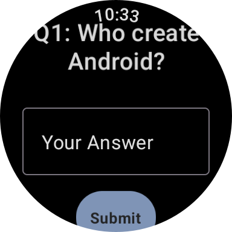
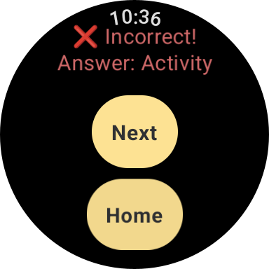
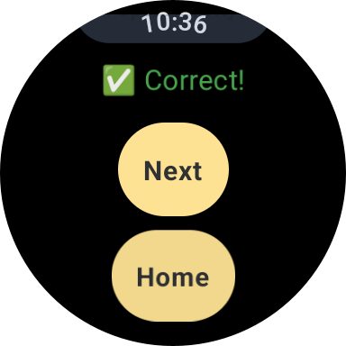
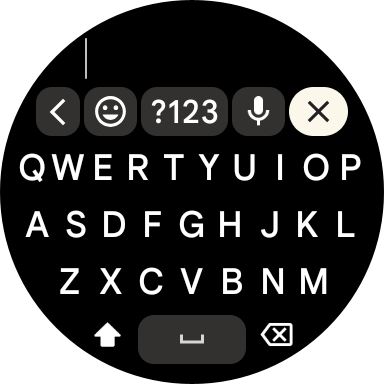
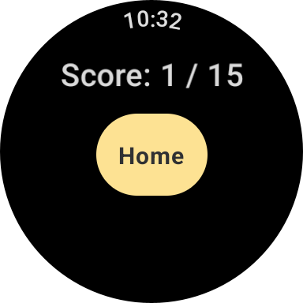

# Week 3 Quiz App (Wear OS)


This is a simple Wear OS app that allows users to take a quiz in different modes: **Multiple Choice** and **Open-Ended**. The app is built using [Jetpack Compose](https://developer.android.com/codelabs/jetpack-compose-basics) for [Wear OS](https://developer.android.com/training/wearables) and follows a modern approach to UI design, [tailored for small wearable devices](https://developer.android.com/training/wearables/user-interfaces). It demonstrates a basic quiz app with interactive elements like [chips](https://developer.android.com/develop/ui/compose/components/chip) for answering questions.

## Wear Quiz App Demo
[](https://github.com/user-attachments/assets/8e177892-2f42-44ea-bbf5-e27c83051f9e)

  
  


## Features

- **Multiple Choice Quiz**: Displays questions with options, and users select an answer. The app provides instant feedback and keeps track of the score.
- **Open-Ended Quiz**: Users provide open-ended answers, and the app checks whether the answer matches the correct one.
<!--- **Splash Screen**: The app includes a splash screen when it starts.-->
- **Score Tracking**: Users' scores are calculated and shown at the end of the quiz.

## Tech Stack

- **Jetpack Compose**: Used for building the UI.
- **Wear OS**: The app is designed specifically for Wear OS devices.
- **Kotlin**: The app is written in Kotlin, which is the preferred language for Android development.
- **Material3**: For UI components and themes.

## Setup

1. **Clone the repository**: git clone <repository-url>

2. **Open the project in Android Studio**:
Open the project in Android Studio that supports Kotlin and Jetpack Compose.

3. **Run on an emulator or a physical Wear OS device**:
Ensure that your development environment is set up to target Wear OS devices. You can run the app on a Wear OS emulator or a physical Wear OS device.

## Usage

When you launch the app, it will display a quiz mode selection screen where you can choose between two quiz modes:

- **Multiple Choice**: You will be presented with multiple-choice questions. Select the correct answer from the available options to earn points.
- **Open-Ended**: You will be asked to provide a text answer to the question. The app will compare your answer with the correct one and give feedback.

After completing the quiz, you will see your score.

## Code Structure

- **MainActivity**: The entry point of the app that sets up the initial content and theme.
- **QuizModeSelection**: A composable function that presents the user with two quiz modes to choose from.
- **MultipleChoiceQuiz**: A composable function for the multiple-choice quiz mode, handling question navigation and score tracking.
- **OpenEndedQuiz**: A composable function for the open-ended quiz mode, where users type in their answers.
- **WearApp**: The main composable that renders the UI and manages the state of the app.
- **QuizQuestion**: A data class representing each quiz question, with optional multiple-choice options and a correct answer.

```kotlin
@Preview(device = Devices.WEAR_OS_SMALL_ROUND, showSystemUi = true)
@Composable
fun DefaultPreview() {
 WearApp()
}
